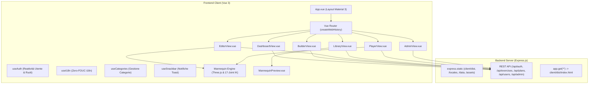
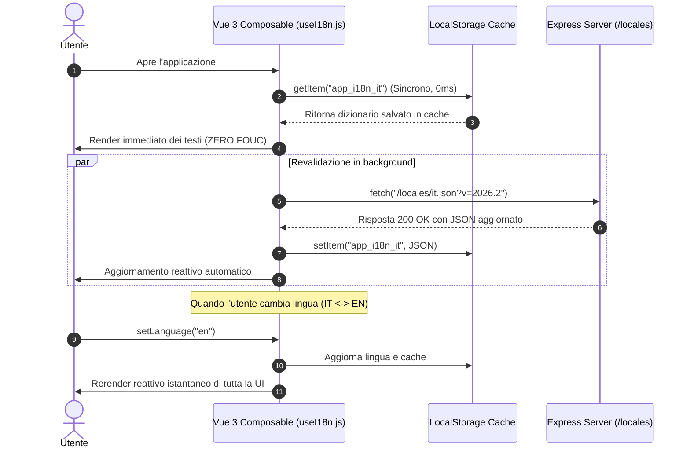

# Architettura Vue 3 Single Page Application (SPA) & Localizzazione Zero-Latency (i18n)

Questo documento descrive in dettaglio l'architettura tecnica per la navigazione istantanea senza ricaricamento del browser (SPA) in **Vue 3**, la gestione del routing con **Vue Router 4**, il motore di rendering 3D **Three.js** e il sistema di internazionalizzazione a zero-latenza implementati in **Pulse HIIT 3D**.

---

## 1. Obiettivi e Scelte Architetturali

1. **Navigazione Reattiva Istantanea (Vue 3 + Vue Router 4)**:
   - Eliminazione completa dei ricaricamenti di finestra (`full page reload`).
   - Transizioni immediate tra Dashboard, Builder, Editor 3D, Libreria, Player e Pannello Amministrazione.
   - Code splitting automatico con caricamento lazy dei componenti delle viste, riducendo le dimensioni del bundle iniziale.

2. **Localizzazione Zero-Latency (0ms FOUC i18n)**:
   - **Problema**: L'attesa del download asincrono dei file di lingua (`/locales/en.json`) causa un fastidioso effetto di "flash" dei testi nella lingua predefinita prima della traduzione.
   - **Soluzione**: Idratare istantaneamente il dizionario leggendo la cache sincrona da `localStorage` nel composable `useI18n.js` (0ms), avviando parallelamente una revalidazione silente in background dal server.

3. **Piena Linkabilità e Deep-Linking (HTML5 History Mode)**:
   - Tutte le rotte (`/`, `/builder`, `/builder?id=...`, `/editor`, `/editor?id=...`, `/library`, `/player?planId=...`, `/admin`) sono URL standard condivisibili.
   - Il server Express gestisce il fallback routing per indirizzare qualsiasi percorso non-API a `client/dist/index.html`.

4. **Isolamento delle Risorse 3D e Prevenzione Memory Leak**:
   - Pulizia automatica dei contesti WebGL di Three.js, degli `requestAnimationFrame` e dei listener di eventi all'unmount dei componenti Vue (`onUnmounted`).

---

## 2. Componenti dell'Architettura



---

## 3. Gestione Risorse 3D nel Ciclo di Vita Vue

Quando l'utente passa da una pagina 3D complessa (come l'Editor di Pose 3D o il Workout Player) a un'altra vista, è fondamentale liberare i contesti WebGL, cancellare i frame di animazione e rimuovere i listener:

```javascript
// In EditorView.vue / PlayerView.vue / MannequinPreview.vue:
onUnmounted(() => {
  if (mannequin) {
    mannequin.stop();
    mannequin.destroy();
    mannequin = null;
  }
});
```

All'interno di `Mannequin.destroy()`:
- `cancelAnimationFrame(this.animFrameId)` interrompe il loop di rendering.
- `window.removeEventListener('resize', this.boundResize)` rimuove i listener globali.
- `this.renderer.dispose()` libera la memoria GPU allocata dal contesto WebGL.

---

## 4. Flusso del Sistema di Internazionalizzazione (i18n)



---

## 5. Compatibilità Mobile SPA (Android & iOS)

1. **Safe Area Insets**:
   - `padding-top: env(safe-area-inset-top)` e `padding-bottom: env(safe-area-inset-bottom)` garantiscono la perfetta leggibilità su dispositivi con notch, dynamic island o gesture bar.
2. **Screen Wake Lock API**:
   - Il composable `useWakeLock` / servizio `wakeLock.js` acquisisce il lock dello schermo all'avvio del workout nel `PlayerView.vue`, impedendo che il dispositivo entri in standby.
3. **Web Audio Unlock & Dynamics Compressor**:
   - Sblocco dell'`AudioContext` al primo tocco utente.
   - Utilizzo di un nodo `DynamicsCompressorNode` per massimizzare il volume e prevenire distorsioni sui piccoli altoparlanti degli smartphone durante i beeps di countdown.
4. **PWA Standalone Web Manifest**:
   - `site.webmanifest` con icone a varie risoluzioni (16x16, 32x32, 48x48, 96x96, 192x192, 512x512) e meta tag `mobile-web-app-capable` e `apple-mobile-web-app-status-bar-style: black-translucent`.

---

## 6. Struttura dei File Frontend (`client/`)

```
client/
├── package.json               # Dipendenze (vue, vue-router, three, vite)
├── vite.config.js             # Configurazione Vite con proxy API verso Express
├── index.html                 # Entry point HTML PWA
└── src/
    ├── main.js                # Bootstrap Vue 3 & caricamento CSS
    ├── App.vue                # Root Layout con NavRail, TopAppBar, BottomNav, Modali
    ├── router/
    │   └── index.js           # Vue Router con lazy loading e fallback
    ├── services/
    │   ├── api.js             # Client API RESTful
    │   ├── audio.js           # Motore audio beeps con dynamics compressor
    │   └── wakeLock.js        # Screen Wake Lock per mobile
    ├── composables/
    │   ├── useAuth.js         # Stato reattivo utente, login, logout, permessi
    │   ├── useI18n.js         # i18n reattivo con cache sincrona
    │   ├── useCategories.js   # Categorie muscolari
    │   └── useSnackbar.js     # Notifiche Snackbar
    ├── mannequin/
    │   └── mannequin.js       # Motore 3D Mannequin modulare con Three.js
    ├── components/
    │   ├── layout/            # NavRail.vue, TopAppBar.vue, BottomNav.vue
    │   ├── auth/              # AuthModal.vue, ProfileSheet.vue
    │   ├── ui/                # Snackbar.vue, ModalDialog.vue
    │   ├── builder/           # ExercisePickerModal.vue
    │   └── mannequin/         # MannequinPreview.vue
    └── views/
        ├── DashboardView.vue  # Home / Dashboard
        ├── BuilderView.vue    # Builder Schede HIIT
        ├── EditorView.vue     # Studio / Editor Pose 3D
        ├── LibraryView.vue    # Catalogo Esercizi
        ├── PlayerView.vue     # Workout Player
        └── AdminView.vue      # Amministrazione & Backup
```
