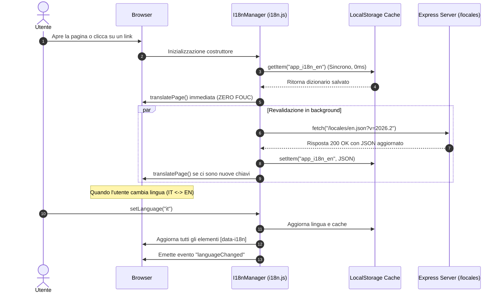

# Architettura SPA (Turbo Drive) e Localizzazione Zero-Latency (i18n)

Questo documento descrive in dettaglio l'architettura tecnica per la navigazione istantanea senza ricaricamento del browser (SPA-like) e il sistema di internazionalizzazione a zero-latenza implementati in **Pulse HIIT 3D**.

---

## 1. Obiettivi e Motivazioni

1. **Eliminazione del Flash di Traduzione (i18n FOUC)**:
   - **Problema precedente**: Il browser scaricava asincronamente i file di lingua (`/locales/en.json`) solo dopo il parsing del DOM. Gli utenti vedevano i testi predefiniti in italiano per circa 1 secondo prima che venissero sostituiti dall'inglese.
   - **Soluzione**: Idratare istantaneamente il dizionario delle traduzioni leggendo la cache sincrona da `localStorage` nel costruttore dell'`I18nManager` (`public/js/i18n.js`) (latenza 0ms), eseguendo poi una revalidazione silente in background.

2. **Navigazione Istantanea stile SPA**:
   - **Problema precedente**: Ogni click di navigazione (Nav Rail laterale, Bottom Navigation, pulsanti di azione) causava un ricaricamento completo della finestra del browser (`full window reload`), con un overhead notevole: riesecuzione e ricaricamento di Three.js (~600 KB), fogli di stile CSS, font Google, parsing degli script e handshake di sessione utente.
   - **Soluzione**: Integrare **Turbo Drive (`@hotwired/turbo`)**, una libreria leggera che intercetta i click sui link standard (`<a href="...">`), effettua un fetch in background del nuovo HTML, sostituisce il `<body>` ed emette eventi di ciclo di vita senza mai ricaricare la finestra.

3. **Piena Linkabilità e Deep-Linking (100% Shareable URLs)**:
   - Ogni pagina (`/`, `/builder`, `/builder?id=...`, `/editor`, `/editor?id=...`, `/library`, `/player?planId=...`, `/admin`) rimane un endpoint HTTP valido, indicizzabile e direttamente condivisibile con parametri query, preservando la cronologia del browser e i pulsanti Indietro/Avanti.

---

## 2. Componenti dell'Architettura

### 2.1 Turbo Drive (`public/js/turbo.min.js`)
- File UMD autonomo (senza dipendenze esterne o CDN) caricato nell'`<head>` di ciascuna pagina HTML.
- **Meccanismo di funzionamento**:
  - Intercetta i click sui tag `<a>` e le submit dei form.
  - Carica la nuova pagina tramite `fetch()`.
  - Mantiene intatta la sessione JavaScript e gli elementi condivisi in memoria (es. istanza `THREE`, engine `Material3`, stato utente in `SharedNav`).
  - Effettua la sostituzione del `<body>` e aggiorna l'URL nella barra degli indirizzi tramite `History.pushState()`.

### 2.2 Ciclo di Vita degli Script e Isolamento (IIFE)
Per evitare errori di collisione globale (`Uncaught SyntaxError: redeclaration of let/const`) e memory leak, ogni script applica i seguenti principi:

1. **Tutti i tag `<script defer>` e fogli di stile CSS presenti nell'`<head>` di ciascuna pagina**:
   - Tutte le pagine condividono lo stesso set di script e stylesheet nell'`<head>`.
   - I file JavaScript vengono scaricati ed eseguiti **una sola volta** al primo accesso.
   - Durante le navigazioni SPA, Turbo rileva che l'`<head>` è invariato e non deve iniettare nuovi script asincroni a runtime (evitando race condition sull'evento `turbo:load`).
2. **Incapsulamento in IIFE Idempotenti & Self-Initialization**:
   - Ogni modulo (`i18n.js`, `material3.js`, `api.js`, `shared-nav.js`, `dashboard.js`, `builder.js`, `editor.js`, `library.js`, `player.js`, `admin.js`) è avvolto in `(function() { if (window.XYZ) return; ... })();`.
   - All'avvio, se `document.readyState !== 'loading'`, lo script esegue immediatamente `init()`.
3. **Ascolto di `turbo:load` & Delegazione degli Eventi su `document`**:
   - I controller ascoltano `turbo:load` per re-inizializzarsi quando viene sostituito il `<body>`.
   - Tutti i listener di click, change, submit e input usano la delega su `document` (ad es. `e.target.closest(...)`), garantendo il perfetto funzionamento anche dopo la sostituzione dinamica del DOM.

---

## 3. Gestione Risorse 3D, Timer e Memory Leak

Quando l'utente passa da una pagina complessa (come l'Editor di Pose 3D o il Workout Player) a un'altra, è fondamentale liberare i contesti WebGL e i timer attivi.

- **Evento `turbo:before-cache`**:
  - Prima che Turbo salvi uno snapshot della pagina corrente, i controller distruggono le istanze 3D e fermano gli intervalli timer:
  ```javascript
  document.addEventListener('turbo:before-cache', () => {
    if (this.mannequin) {
      this.mannequin.destroy();
      this.mannequin = null;
    }
    if (this.timerInterval) {
      clearInterval(this.timerInterval);
      this.timerInterval = null;
    }
  });
  ```
- **Ripristino su `turbo:load`**:
  - Al rientro sulla pagina, il controller rileva la presenza del `<canvas>` ed istanzia nuovamente il rendering Three.js.

---

## 4. Flusso del Sistema di Internazionalizzazione (i18n)



---

## 5. Attributi HTML per la Traduzione

Il sistema scansiona automaticamente il DOM a ogni navigazione e aggiorna i nodi in base ai seguenti attributi:

| Attributo | Descrizione | Esempio |
| :--- | :--- | :--- |
| `data-i18n` | Imposta il `textContent` dell'elemento | `<h1 data-i18n="dashboard.title">Allenamenti</h1>` |
| `data-i18n-placeholder` | Imposta il `placeholder` dell'input | `<input data-i18n-placeholder="builder.plan_name_placeholder">` |
| `data-i18n-title` | Imposta il `title` (tooltip) dell'elemento | `<button data-i18n-title="editor.undo"></button>` |
| `data-i18n-html` | Imposta l'`innerHTML` dell'elemento | `<span data-i18n-html="admin.backup_desc"></span>` |

---

## 6. Ottimizzazione HTTP & Header di Caching

Nel server Express (`server/index.js`), le risorse statiche e i dizionari di localizzazione sono serviti con header di caching ottimali:

```javascript
const staticOptions = {
  maxAge: '1d',
  etag: true,
  lastModified: true
};
app.use('/locales', express.static(path.join(__dirname, '../public/locales'), staticOptions));
app.use(express.static(path.join(__dirname, '../public'), staticOptions));
```

- Gli asset già scaricati vengono serviti dalla memoria cache del browser (304 Not Modified o cache locale), minimizzando il traffico di rete e azzerando i tempi di risposta.

---

## 7. Struttura dei File Coinvolti

```
exercise-planner/
├── public/
│   ├── js/
│   │   ├── turbo.min.js        # Turbo Drive UMD standalone
│   │   ├── i18n.js             # Gestore i18n con cache sincrona localStorage
│   │   ├── material3.js        # UI engine (ripple, floating labels, snackbar)
│   │   ├── api.js              # Client API centralizzato
│   │   ├── shared-nav.js       # Gestore rail, bottom nav, auth sheet
│   │   ├── dashboard.js        # Controller home/dashboard
│   │   ├── builder.js          # Controller creazione schede
│   │   ├── editor.js           # Controller simulatore/pose 3D Three.js
│   │   ├── library.js          # Controller catalogo esercizi & anteprima 3D
│   │   ├── player.js           # Controller player allenamento fullscreen
│   │   └── admin.js            # Controller pannello admin & backup DB
│   ├── locales/
│   │   ├── it.json             # Dizionario Italiano
│   │   └── en.json             # Dizionario Inglese
│   ├── index.html              # Dashboard
│   ├── builder.html            # Builder Schede
│   ├── editor.html             # Editor Pose 3D
│   ├── library.html            # Libreria Esercizi
│   ├── player.html             # Workout Player
│   └── admin.html              # Amministrazione
├── server/
│   └── index.js                # Express Server, routing e cache statici
└── docs/
    ├── RENDER_DEPLOY_GUIDE.md
    └── SPA_ROUTING_AND_I18N_ARCHITECTURE.md
```
